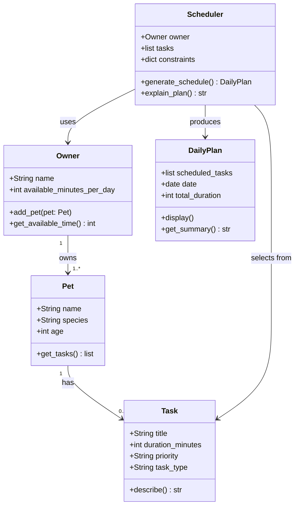

# PawPal+ Project Reflection

## 1. System Design

**a. Initial design**

My initial design identified five classes, each with a single, clear responsibility.

- **Task** is the smallest unit in the system. It holds everything the scheduler needs to evaluate a care activity: a title, how long it takes (`duration_minutes`), how important it is (`priority`), and what kind of care it represents (`task_type`). It is a pure data object with one helper method, `describe()`, that returns a readable summary string.

- **Pet** represents the animal being cared for. It stores identity information (name, species, age) and owns a list of `Task` objects. Its responsibility is to be the container that links a pet to its care needs. It exposes `add_task()` and `get_tasks()` so the rest of the system can interact with its tasks without touching the internal list directly.

- **Owner** represents the person using the app. Its most important attribute is `available_minutes_per_day`, which is the core constraint the scheduler works within. It also holds a list of pets via `add_pet()` / `get_pets()`, and exposes `get_available_time()` as a clean interface for the scheduler to query.

- **Scheduler** is where the planning logic lives. It takes an `Owner` (for the time budget) and a flat list of `Task` objects as input. `generate_schedule()` sorts tasks by priority and greedily selects tasks that fit within the time budget. `explain_plan()` produces a plain-English explanation of why each task was included or skipped.

- **DailyPlan** is the output object produced by the scheduler. It holds the ordered list of scheduled tasks, the list of skipped tasks, the date, and the total duration. It has no logic — its only job is to hold results and provide `display()` and `get_summary()` for the UI layer.

**Three core user actions the system supports:**

1. **Add a pet** — The user enters basic owner and pet information (owner name, pet name, species, age). This creates the context the scheduler needs to personalize the plan.

2. **Add and manage care tasks** — The user defines individual care tasks (e.g., morning walk, feeding, grooming, medication). Each task specifies a title, estimated duration in minutes, and a priority level (low / medium / high). Tasks can be added, edited, or removed before generating a plan.

3. **Generate today's schedule** — The user triggers the scheduler, which selects and orders tasks that fit within the owner's available time for the day, ranked by priority. The system displays the resulting plan and explains why each task was included or excluded.

---

**Building blocks (objects) identified:**

**Owner**
- Attributes: `name`, `available_minutes_per_day`
- Methods: `add_pet()`, `get_available_time()`
- Responsibility: Represents the person managing pet care; provides the time constraint the scheduler works within.

**Pet**
- Attributes: `name`, `species`, `age`
- Methods: `get_tasks()`
- Responsibility: Holds pet identity; linked to the owner and associated tasks.

**Task**
- Attributes: `title`, `duration_minutes`, `priority`, `task_type`
- Methods: `describe()`
- Responsibility: Represents a single care activity with everything the scheduler needs to evaluate and slot it into a plan.

**Scheduler**
- Attributes: `tasks`, `owner`, `constraints`
- Methods: `generate_schedule()`, `explain_plan()`
- Responsibility: Core logic — selects tasks that fit within time constraints, ordered by priority, and produces an explanation of the choices made.

**DailyPlan**
- Attributes: `scheduled_tasks`, `date`, `total_duration`
- Methods: `display()`, `get_summary()`
- Responsibility: Holds the output of the scheduler — the ordered list of tasks for the day and metadata for display in the UI.

**b. UML Class Diagram (Mermaid.js)**



**Design notes:**
- `Owner` owns one or more `Pet` objects (1 to many)
- Each `Pet` has zero or more associated `Task` objects
- `Scheduler` takes the owner (for time constraints) and all tasks as input, then produces a `DailyPlan`
- `DailyPlan` is a pure output object — it holds results for display and does not feed back into the scheduler

**c. Design changes**

Yes, the design changed in two ways after reviewing the skeleton for missing relationships and logic bottlenecks.

**Change 1 — Added `Owner.get_all_tasks()`**

The original design had `Owner → Pet → Task` as a chain in the UML, but `Scheduler` accepted a flat `list[Task]` directly. This meant the relationship existed on paper but nothing in the code actually traversed it — a caller would have to manually loop over every pet and collect tasks before constructing a `Scheduler`. This is a missing bridge.

I added `get_all_tasks()` to `Owner`, which walks its pets and returns a combined flat list of all tasks. Now the scheduler can be constructed naturally:

```python
scheduler = Scheduler(owner=owner, tasks=owner.get_all_tasks())
```

This makes the UML relationship real in the code, not just in the diagram.

**Change 2 — Added priority validation in `Task.__post_init__()`**

The original `Task` accepted any string for `priority`. An invalid value like `"urgent"` or `"High"` would silently sort to the very bottom (priority 99 in `PRIORITY_ORDER`), producing a wrong schedule with no error or warning.

I added a `__post_init__` method that raises a `ValueError` immediately if the priority isn't one of `{"low", "medium", "high"}`. This catches mistakes at the point of data entry rather than silently corrupting the schedule output.

**Change not made — greedy algorithm**

The review also flagged that the greedy scheduler can skip a high-priority task that's too long, even if removing a low-priority task would have made room. This is a real limitation but is a reasonable tradeoff for this scenario (see section 2b), so the algorithm was left unchanged.

---

## 2. Scheduling Logic and Tradeoffs

**a. Constraints and priorities**

The scheduler considers two constraints: **available time** (the owner's daily time budget in minutes) and **task priority** (high / medium / low). Tasks are sorted by priority first, then selected greedily until the time budget is exhausted. A task's `frequency` ("daily", "weekly", "as-needed") is also respected — tasks are only scheduled if their `next_due` date is today or earlier, so completed recurring tasks are automatically suppressed until their next occurrence.

Priority was treated as the most important constraint because missing a high-priority task (e.g., medication) is more harmful than running out of time for a low-priority one (e.g., grooming). Time is a hard constraint: no task is scheduled that would push the total over the owner's stated budget.

**b. Tradeoffs**

**Tradeoff: conflict detection warns but does not re-schedule.**

The `detect_conflicts()` method identifies overlapping tasks by comparing each pair's time windows (`[start, start + duration)`). When a conflict is found, it returns a warning string — it does not move, drop, or reorder the conflicting tasks. This means the final schedule can still contain overlapping items; the owner is informed and must resolve it manually.

This tradeoff is reasonable for this scenario for two reasons. First, automatically resolving conflicts (e.g., bumping a task to a later slot) requires knowing the owner's full day calendar, which the app does not have. A wrong auto-reschedule (e.g., moving medication to the evening) could be worse than the conflict itself. Second, a warning gives the owner agency — they may decide one task can be done by a second person, or that the overlap is acceptable (e.g., a quick feeding while a walk is being prepared). Crashing or silently dropping tasks would be worse than surfacing the issue and letting the owner decide.

A secondary tradeoff is that the greedy algorithm can skip a high-priority task whose duration is too long, even if removing a lower-priority task would have freed enough room. This keeps the algorithm simple and predictable (O(n log n) sort + O(n) scan) at the cost of occasionally sub-optimal selections.

---

## 3. AI Collaboration

**a. How you used AI**

- How did you use AI tools during this project (for example: design brainstorming, debugging, refactoring)?
- What kinds of prompts or questions were most helpful?

**b. Judgment and verification**

- Describe one moment where you did not accept an AI suggestion as-is.
- How did you evaluate or verify what the AI suggested?

---

## 4. Testing and Verification

**a. What you tested**

- What behaviors did you test?
- Why were these tests important?

**b. Confidence**

- How confident are you that your scheduler works correctly?
- What edge cases would you test next if you had more time?

---

## 5. Reflection

**a. What went well**

- What part of this project are you most satisfied with?

**b. What you would improve**

- If you had another iteration, what would you improve or redesign?

**c. Key takeaway**

- What is one important thing you learned about designing systems or working with AI on this project?
