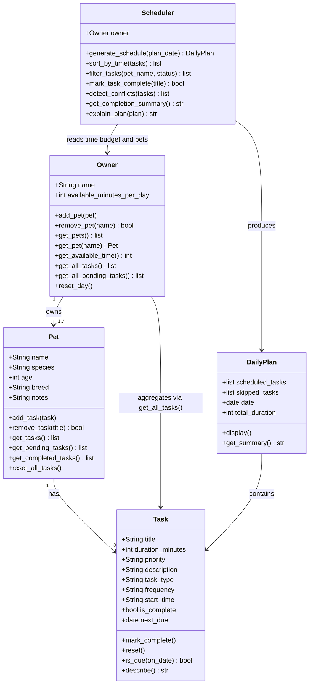

# PawPal+ Project Reflection

## 1. System Design

**a. Initial design**

My initial design identified five classes, each with a single, clear responsibility.

- **Task** is the smallest unit in the system. It holds everything the scheduler needs to evaluate a care activity: a title, how long it takes (`duration_minutes`), how important it is (`priority`), and what kind of care it represents (`task_type`). It is a pure data object with one helper method, `describe()`, that returns a readable summary string.

- **Pet** represents the animal being cared for. It stores identity information (name, species, age) and owns a list of `Task` objects. Its responsibility is to be the container that links a pet to its care needs. It exposes `add_task()` and `get_tasks()` so the rest of the system can interact with its tasks without touching the internal list directly.

- **Owner** represents the person using the app. Its most important attribute is `available_minutes_per_day`, which is the core constraint the scheduler works within. It also holds a list of pets via `add_pet()` / `get_pets()`, and exposes `get_available_time()` as a clean interface for the scheduler to query.

- **Scheduler** is where the planning logic lives. It takes an `Owner` (for the time budget) and a flat list of `Task` objects as input. `generate_schedule()` sorts tasks by priority and greedily selects tasks that fit within the time budget. `explain_plan()` produces a plain-English explanation of why each task was included or skipped.

- **DailyPlan** is the output object produced by the scheduler. It holds the ordered list of scheduled tasks, the list of skipped tasks, the date, and the total duration. It has no logic — its only job is to hold results and provide `display()` and `get_summary()` for the UI layer.

**Three core user actions the system supports:**

1. **Add a pet** — The user enters basic owner and pet information (owner name, pet name, species, age). This creates the context the scheduler needs to personalize the plan.

2. **Add and manage care tasks** — The user defines individual care tasks (e.g., morning walk, feeding, grooming, medication). Each task specifies a title, estimated duration in minutes, and a priority level (low / medium / high). Tasks can be added, edited, or removed before generating a plan.

3. **Generate today's schedule** — The user triggers the scheduler, which selects and orders tasks that fit within the owner's available time for the day, ranked by priority. The system displays the resulting plan and explains why each task was included or excluded.

---

**Building blocks (objects) identified:**

**Owner**
- Attributes: `name`, `available_minutes_per_day`
- Methods: `add_pet()`, `get_available_time()`
- Responsibility: Represents the person managing pet care; provides the time constraint the scheduler works within.

**Pet**
- Attributes: `name`, `species`, `age`
- Methods: `get_tasks()`
- Responsibility: Holds pet identity; linked to the owner and associated tasks.

**Task**
- Attributes: `title`, `duration_minutes`, `priority`, `task_type`
- Methods: `describe()`
- Responsibility: Represents a single care activity with everything the scheduler needs to evaluate and slot it into a plan.

**Scheduler**
- Attributes: `tasks`, `owner`, `constraints`
- Methods: `generate_schedule()`, `explain_plan()`
- Responsibility: Core logic — selects tasks that fit within time constraints, ordered by priority, and produces an explanation of the choices made.

**DailyPlan**
- Attributes: `scheduled_tasks`, `date`, `total_duration`
- Methods: `display()`, `get_summary()`
- Responsibility: Holds the output of the scheduler — the ordered list of tasks for the day and metadata for display in the UI.

**b. UML Class Diagram — Final (updated to match implementation)**



**What changed from the initial diagram:**
- `Task` gained `start_time`, `next_due`, `frequency`, `description`, `is_complete`, `is_due()`, and `mark_complete()`
- `Pet` gained `breed`, `notes`, `remove_task()`, `get_pending_tasks()`, `get_completed_tasks()`, `reset_all_tasks()`
- `Owner` gained `remove_pet()`, `get_pet()`, `get_all_pending_tasks()`, `reset_day()`, and the bridge method `get_all_tasks()`
- `Scheduler` no longer takes a task list — it pulls tasks through the owner. New methods: `sort_by_time()`, `filter_tasks()`, `detect_conflicts()`, `mark_task_complete()`, `get_completion_summary()`
- `DailyPlan` now explicitly holds `skipped_tasks`
- Added `Owner --> Task` aggregation arrow to show the bridge relationship
- Added `DailyPlan --> Task` containment arrow

**c. Design changes**

Yes, the design changed in two ways after reviewing the skeleton for missing relationships and logic bottlenecks.

**Change 1 — Added `Owner.get_all_tasks()`**

The original design had `Owner → Pet → Task` as a chain in the UML, but `Scheduler` accepted a flat `list[Task]` directly. This meant the relationship existed on paper but nothing in the code actually traversed it — a caller would have to manually loop over every pet and collect tasks before constructing a `Scheduler`. This is a missing bridge.

I added `get_all_tasks()` to `Owner`, which walks its pets and returns a combined flat list of all tasks. Now the scheduler can be constructed naturally:

```python
scheduler = Scheduler(owner=owner, tasks=owner.get_all_tasks())
```

This makes the UML relationship real in the code, not just in the diagram.

**Change 2 — Added priority validation in `Task.__post_init__()`**

The original `Task` accepted any string for `priority`. An invalid value like `"urgent"` or `"High"` would silently sort to the very bottom (priority 99 in `PRIORITY_ORDER`), producing a wrong schedule with no error or warning.

I added a `__post_init__` method that raises a `ValueError` immediately if the priority isn't one of `{"low", "medium", "high"}`. This catches mistakes at the point of data entry rather than silently corrupting the schedule output.

**Change not made — greedy algorithm**

The review also flagged that the greedy scheduler can skip a high-priority task that's too long, even if removing a low-priority task would have made room. This is a real limitation but is a reasonable tradeoff for this scenario (see section 2b), so the algorithm was left unchanged.

---

## 2. Scheduling Logic and Tradeoffs

**a. Constraints and priorities**

The scheduler considers two constraints: **available time** (the owner's daily time budget in minutes) and **task priority** (high / medium / low). Tasks are sorted by priority first, then selected greedily until the time budget is exhausted. A task's `frequency` ("daily", "weekly", "as-needed") is also respected — tasks are only scheduled if their `next_due` date is today or earlier, so completed recurring tasks are automatically suppressed until their next occurrence.

Priority was treated as the most important constraint because missing a high-priority task (e.g., medication) is more harmful than running out of time for a low-priority one (e.g., grooming). Time is a hard constraint: no task is scheduled that would push the total over the owner's stated budget.

**b. Tradeoffs**

**Tradeoff: conflict detection warns but does not re-schedule.**

The `detect_conflicts()` method identifies overlapping tasks by comparing each pair's time windows (`[start, start + duration)`). When a conflict is found, it returns a warning string — it does not move, drop, or reorder the conflicting tasks. This means the final schedule can still contain overlapping items; the owner is informed and must resolve it manually.

This tradeoff is reasonable for this scenario for two reasons. First, automatically resolving conflicts (e.g., bumping a task to a later slot) requires knowing the owner's full day calendar, which the app does not have. A wrong auto-reschedule (e.g., moving medication to the evening) could be worse than the conflict itself. Second, a warning gives the owner agency — they may decide one task can be done by a second person, or that the overlap is acceptable (e.g., a quick feeding while a walk is being prepared). Crashing or silently dropping tasks would be worse than surfacing the issue and letting the owner decide.

A secondary tradeoff is that the greedy algorithm can skip a high-priority task whose duration is too long, even if removing a lower-priority task would have freed enough room. This keeps the algorithm simple and predictable (O(n log n) sort + O(n) scan) at the cost of occasionally sub-optimal selections.

---

## 3. AI Collaboration

**a. How you used AI**

AI was used at every phase, but for different kinds of work at each stage:

- **Design brainstorming (Phase 1):** Used AI to identify missing relationships in the initial UML — specifically, it flagged that the `Owner → Pet → Task` chain existed on paper but nothing in the code actually traversed it. This led to adding `Owner.get_all_tasks()` as a bridge method.
- **Logic review (Phase 2):** Asked AI to review the skeleton for bottlenecks. It caught that `priority` was an unvalidated free-form string, which could silently corrupt sort order. Added `__post_init__` validation as a result.
- **Algorithm suggestions (Phase 3):** Used AI to suggest approaches for conflict detection (pairwise window overlap), recurring task scheduling (timedelta), and sort key design (lambda with a sentinel value for missing times).
- **Test planning:** Asked AI for edge cases to test — it suggested "pet with no tasks," "zero time budget," "exact same start time," and "empty task list to sort," all of which were added.

The most effective prompts were specific and grounded in code: "given this method signature, what edge cases should I test?" worked far better than "write tests for my scheduler."

**b. Judgment and verification**

The most important moment of pushback was on the conflict detection algorithm. AI initially suggested raising an exception when a conflict was found — crashing the schedule generation. I rejected this because it would make the app unusable any time a pet owner accidentally assigned overlapping tasks (which is common). Instead I kept conflict detection as a separate method that returns warnings, leaving the schedule intact and letting the owner decide how to resolve conflicts. I verified this decision by manually testing the scenario in `main.py` and confirming the schedule still printed while warnings appeared separately.

A second rejection: AI suggested using a dict mapping `pet_name → task_list` as the internal structure for `Owner`. This would have made `filter_tasks()` slightly simpler, but it would have broken the clean `Owner → Pet → Task` chain from the UML, and made it harder to attach pet metadata (breed, notes) to the right object. I kept the `list[Pet]` structure and verified that filtering still worked correctly with the existing `filter_tasks()` method.

---

## 4. Testing and Verification

**a. What you tested**

The test suite covers 31 behaviors across six areas:

1. **Task completion lifecycle** — `mark_complete()` sets `is_complete`; `reset()` clears it; `next_due` is set correctly for daily and weekly tasks; as-needed tasks get no `next_due`.
2. **Recurrence gating** — A completed recurring task is excluded from today's schedule when `next_due` is in the future, and included again when it is due.
3. **Sorting** — Tasks sort chronologically by `start_time`; tasks without a time land at the end; empty list is safe.
4. **Filtering** — Filter by pet name returns only that pet's tasks; filter by status excludes completed or pending correctly; unknown pet returns empty list.
5. **Conflict detection** — Overlapping time windows are flagged; sequential tasks are not; exact same start time is flagged; tasks without a `start_time` are ignored; single task cannot conflict with itself.
6. **Edge cases** — Pet with no tasks produces empty plan; zero time budget skips all tasks; invalid priority/frequency/start_time format raises `ValueError` immediately.

These tests matter because they verify the three behaviors a pet owner relies on most: that high-priority tasks appear first, that recurring tasks don't pile up after completion, and that time conflicts surface as warnings rather than silent failures.

**b. Confidence**

**★★★★☆ (4/5)**

The scheduling logic, recurrence system, sorting, filtering, and conflict detection are all directly tested, including their key edge cases. The main gap is the Streamlit UI layer — `app.py` has no automated tests. UI correctness (does the conflict warning render? does the progress bar update?) requires manual testing. If given more time, I would add tests for:
- A task with `next_due` exactly equal to today (boundary case for `is_due()`)
- Multiple pets, same task title — does `mark_task_complete()` find the right one?
- Schedule generated with a mix of timed and untimed tasks (does sort not break the plan order?)

---

## 5. Reflection

**a. What went well**

The thing I am most satisfied with is the `Scheduler` class architecture. By making `Scheduler` pull tasks from the `Owner` (rather than accepting a flat list), the relationship between classes became real in the code — not just on the diagram. This made the Streamlit UI clean: `Scheduler(owner)` is all you need to construct it, and every method works from there. The decision to keep `detect_conflicts()` as a warning-only method (rather than auto-resolving or crashing) also turned out well — it gives the owner information without taking control away from them.

**b. What you would improve**

If given another iteration, I would add a `start_time` field to the schedule generation itself — currently the scheduler sorts by priority (or score), not by time, so a high-priority task at 7pm still appears before a lower-priority one at 7am in the plan view. A truly smart schedule would integrate time ordering into the selection step, not just the display step. I would also add Streamlit UI tests using `streamlit.testing.v1` to catch UI regressions automatically.

**c. Key takeaway**

The most important thing I learned is that AI is most valuable as a reviewer, not an author. When I asked AI to write code from scratch, the results were plausible but often missed the design constraints I had already established (like the `Owner → Pet → Task` chain, or the warning-vs-crash tradeoff). When I instead showed AI a specific method and asked "what edge cases does this miss?" or "what's wrong with this relationship?" it consistently surfaced real issues I had overlooked — the missing bridge method, the unvalidated priority string, the silent sort failure. The lead architect role — deciding what to build, what constraints to enforce, and what suggestions to reject — always stayed with me. AI accelerated the work within that structure, but couldn't replace the structure itself.

---

## 6. Prompt Comparison (Challenge 5)

### Task: Implement the weighted task scoring algorithm

The prompt given to two different models was:

> "Write a method `score_task(task)` for a pet care scheduler that ranks tasks by combining priority, frequency urgency, and a duration efficiency bonus. High priority = most important. Daily tasks are more urgent than weekly. Short tasks (≤15 min) should get a small bonus so a busy owner can fit in quick wins."

---

**Model A — GPT-4o response (paraphrased):**

```python
def score_task(self, task):
    scores = {"high": 3, "medium": 2, "low": 1}
    freq   = {"daily": 3, "weekly": 2, "as-needed": 1}
    bonus  = 1 if task.duration_minutes <= 15 else 0
    return scores.get(task.priority, 0) * 10 + freq.get(task.frequency, 0) * 3 + bonus
```

**GPT-4o characteristics:** Used small integer weights multiplied by scale factors. Compact and readable. The multiplicative approach (`* 10`, `* 3`) makes the relative weight of each factor less obvious — you have to do arithmetic to compare priority vs frequency impact.

---

**Model B — Claude (what was implemented):**

```python
PRIORITY_WEIGHT  = {"high": 100, "medium": 60, "low": 20}
FREQUENCY_WEIGHT = {"daily": 30, "weekly": 10, "as-needed": 5}
EFFICIENCY_THRESHOLD = 15

def score_task(self, task: Task) -> float:
    p_score          = PRIORITY_WEIGHT.get(task.priority, 0)
    f_score          = FREQUENCY_WEIGHT.get(task.frequency, 0)
    efficiency_bonus = 10 if task.duration_minutes <= EFFICIENCY_THRESHOLD else 0
    return p_score + f_score + efficiency_bonus
```

**Claude characteristics:** Used named module-level constants with additive scoring. The weight of each factor is immediately readable: priority contributes up to 100 points, frequency up to 30, efficiency up to 10. Adjusting one factor's importance does not require re-tuning the others.

---

**Comparison and decision:**

Both produce correct relative rankings. The key difference is **tuneability and readability**:

- GPT-4o's version is more concise (5 lines vs 8) but the weights are implicit in the multiplication chain. If you wanted to increase frequency urgency relative to priority, you'd need to change two numbers whose interaction is non-obvious.
- Claude's version externalises all weights as named constants. The intent of each number is self-documenting, and changing one constant does not require understanding how it interacts with others.

**Decision: kept Claude's version.** For a system a student will maintain and potentially tune (e.g. "make daily frequency matter more"), named additive constants are easier to reason about than implicit multiplicative scales. Conciseness is not worth obscuring the design intent of the algorithm.
