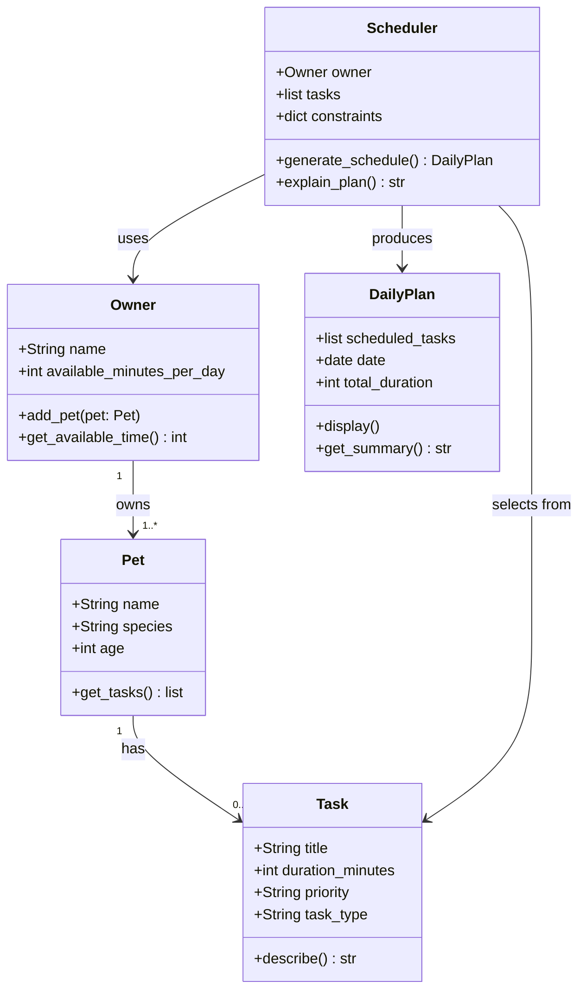

# PawPal+ Project Reflection

## 1. System Design

**a. Initial design**

**Three core user actions the system supports:**

1. **Add a pet** — The user enters basic owner and pet information (owner name, pet name, species, age). This creates the context the scheduler needs to personalize the plan.

2. **Add and manage care tasks** — The user defines individual care tasks (e.g., morning walk, feeding, grooming, medication). Each task specifies a title, estimated duration in minutes, and a priority level (low / medium / high). Tasks can be added, edited, or removed before generating a plan.

3. **Generate today's schedule** — The user triggers the scheduler, which selects and orders tasks that fit within the owner's available time for the day, ranked by priority. The system displays the resulting plan and explains why each task was included or excluded.

---

**Building blocks (objects) identified:**

**Owner**
- Attributes: `name`, `available_minutes_per_day`
- Methods: `add_pet()`, `get_available_time()`
- Responsibility: Represents the person managing pet care; provides the time constraint the scheduler works within.

**Pet**
- Attributes: `name`, `species`, `age`
- Methods: `get_tasks()`
- Responsibility: Holds pet identity; linked to the owner and associated tasks.

**Task**
- Attributes: `title`, `duration_minutes`, `priority`, `task_type`
- Methods: `describe()`
- Responsibility: Represents a single care activity with everything the scheduler needs to evaluate and slot it into a plan.

**Scheduler**
- Attributes: `tasks`, `owner`, `constraints`
- Methods: `generate_schedule()`, `explain_plan()`
- Responsibility: Core logic — selects tasks that fit within time constraints, ordered by priority, and produces an explanation of the choices made.

**DailyPlan**
- Attributes: `scheduled_tasks`, `date`, `total_duration`
- Methods: `display()`, `get_summary()`
- Responsibility: Holds the output of the scheduler — the ordered list of tasks for the day and metadata for display in the UI.

**b. UML Class Diagram (Mermaid.js)**

**Design notes:**
- `Owner` owns one or more `Pet` objects (1 to many)
- Each `Pet` has zero or more associated `Task` objects
- `Scheduler` takes the owner (for time constraints) and all tasks as input, then produces a `DailyPlan`
- `DailyPlan` is a pure output object — it holds results for display and does not feed back into the scheduler

**c. Design changes**

- Did your design change during implementation?
- If yes, describe at least one change and why you made it.

---

## 2. Scheduling Logic and Tradeoffs

**a. Constraints and priorities**

- What constraints does your scheduler consider (for example: time, priority, preferences)?
- How did you decide which constraints mattered most?

**b. Tradeoffs**

- Describe one tradeoff your scheduler makes.
- Why is that tradeoff reasonable for this scenario?

---

## 3. AI Collaboration

**a. How you used AI**

- How did you use AI tools during this project (for example: design brainstorming, debugging, refactoring)?
- What kinds of prompts or questions were most helpful?

**b. Judgment and verification**

- Describe one moment where you did not accept an AI suggestion as-is.
- How did you evaluate or verify what the AI suggested?

---

## 4. Testing and Verification

**a. What you tested**

- What behaviors did you test?
- Why were these tests important?

**b. Confidence**

- How confident are you that your scheduler works correctly?
- What edge cases would you test next if you had more time?

---

## 5. Reflection

**a. What went well**

- What part of this project are you most satisfied with?

**b. What you would improve**

- If you had another iteration, what would you improve or redesign?

**c. Key takeaway**

- What is one important thing you learned about designing systems or working with AI on this project?
